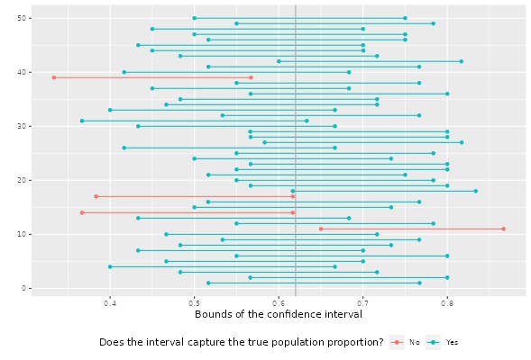
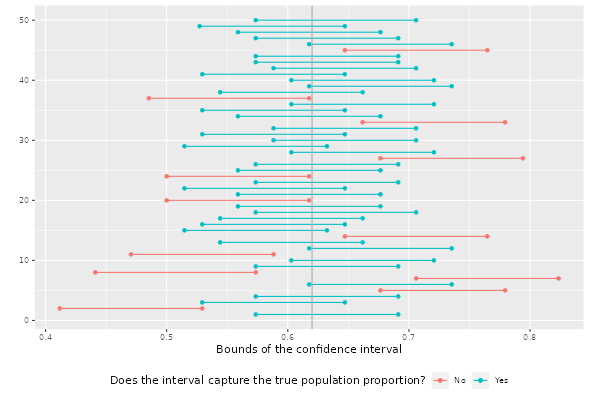

```{r load-packages, message=FALSE}
library(tidyverse)
library(openintro)
library(infer)
set.seed(42)
```

```{r}
us_adults <- tibble(
  climate_change_affects = c(rep("Yes", 62000), rep("No", 38000))
)
```

```{r}
ggplot(us_adults, aes(x = climate_change_affects)) +
  geom_bar()+
  labs(
    x = "", y = "",
    title = "Do you think climate change is affecting your local community?")+
  coord_flip()
```

```{r}
us_adults %>%
  group_by(climate_change_affects) %>%
  summarise(n = n()) %>%
  mutate(p = n/sum(n))
```

```{r}
n <- 60
samp <- us_adults%>%
  sample_n(n)
```

### Exercise 1
What percent of the adults in your sample think climate change affects their local community?

- In this sample, approximately 63% of adults think climate change affects their local community.

```{r ex1}
(
samp %>%
  group_by(climate_change_affects)%>%
  summarise(n = n())%>%
  mutate(p = n/sum(n))
)
```

### Exercise 2
Would you expect another student’s sample proportion to be identical to yours? Would you expect it to be similar? Why or why not?

- It's hard, but possible, that another student's sample proportion is identical to mine, however, it's likely to be close to my value because the sample was from the same population and hence the sample proportions are expected to be close to each other.

```{r}
samp %>%
  specify(response = climate_change_affects, success = "Yes") %>%
  generate(reps = 1000, type = "bootstrap") %>%
  calculate(stat = "prop") %>%
  get_ci(level = 0.95)
```
### Exercise 3
In the interpretation above, we used the phrase “95% confident”. What does “95% confidence” mean?

- It means that if we were to take 100 samples and compute a 95% confidence interval to each of them, then approximately 95 of them will capture the true population proportion. Similarly, there is a 5% chance that the confidence interval will not capture the true population mean. It also means that 95% of the samples proportions lie between our confidence interval.

### Exercise 4
Does your confidence interval capture the true population proportion of US adults who think climate change affects their local community? If you are working on this lab in a classroom, does your neighbor’s interval capture this value?

- My confidence interval (0.52, 0.75) captures the true population proportion of US adults who think climate change affects their local community (0.62). 
Asking three classmates, they all capture the true population proportion.

### Exercise 5
Each student should have gotten a slightly different confidence interval. What proportion of those intervals would you expect to capture the true population mean? Why?

- 95% are expected to capture the true population proportion because, by definition, 95% of the confidence intervals generated will capture the true proportion.

### Exercise 6
Given a sample size of 60, 1000 bootstrap samples for each interval, and 50 confidence intervals constructed (the default values for the above app), what proportion of your confidence intervals include the true population proportion? Is this proportion exactly equal to the confidence level? If not, explain why. Make sure to include your plot in your answer.

- 46/50 confidence intervals capture the true population proportion (92%). That is not exactly equal to the confidence level (0.95).




### Exercise 7
Choose a different confidence level than 95%. Would you expect a confidence interval at this level to be wider or narrower than the confidence interval you calculated at the 95% confidence level? Explain your reasoning.

- I chose 60% confidence level, I expect that the confidence interval would be narrower because a lower confidence level means a lower margin of error; hence there are less values above or below the sample proportion.

### Exercise 8
Using code from the infer package and data from the one sample you have (samp), find a confidence interval for the proportion of US Adults who think climate change is affecting their local community with a confidence level of your choosing (other than 95%) and interpret it.

- We are 70% confident that the true population proportion of adults who think that climate change is affecting their local community lies between 0.57 and 0.70.

```{r ex8}
samp %>%
  specify(response = climate_change_affects, success = "Yes") %>%
  generate(reps = 1000, type = "bootstrap") %>%
  calculate(stat = "prop") %>%
  get_ci(level = 0.70)
```

### Exercise 9
Using the app, calculate 50 confidence intervals at the confidence level you chose in the previous question, and plot all intervals on one plot, and calculate the proportion of intervals that include the true population proportion. How does this percentage compare to the confidence level selected for the intervals?

- 38/50 confidence intervals (72%) capture the true population proportion. That is different, but close, to the confidence level of 0.70. In other words, the proportion of the confidence intervals which capture the true proportion is greater than the confidence level (0.72 > 0.70).



### Exercise 10
Lastly, try one more (different) confidence level. First, state how you expect the width of this interval to compare to previous ones you calculated. Then, calculate the bounds of the interval using the infer package and data from samp and interpret it. Finally, use the app to generate many intervals and calculate the proportion of intervals that capture the true population proportion.

- Confidence level: 0.50. I expect the width to be narrower than any of the confidence intervals chosen above. The lower bound is 0.58 and the upper bound is 0.67. Therefore, we are 60% confident that the true proportion of the population lies between 0.58 and 0.67. 48/100 confidence intervals (48%) capture the true population proportion.

```{r ex10}
samp %>%
  specify(response = climate_change_affects, success = "Yes") %>%
  generate(reps = 1000, type = "bootstrap") %>%
  calculate(stat = "prop") %>%
  get_ci(level = 0.50)
```

### Exercise 11
Using the app, experiment with different sample sizes and comment on how the widths of intervals change as sample size changes (increases and decreases).

- As the sample size increases, the widths of the confidence intervals get narrower.

### Exercise 12
Finally, given a sample size (say, 60), how does the width of the interval change as you increase the number of bootstrap samples. Hint: Does changing the number of bootstrap samples affect the standard error?

- Changing the number of bootstrap samples seems not to affect the width of the interval. The standard error is dependent on the sample size and the population standard deviation, which clarifies why the number of bootstrap samples does not affect the width of the interval. Nevertheless, increasing the bootstrap samples gives better estimates.

...

